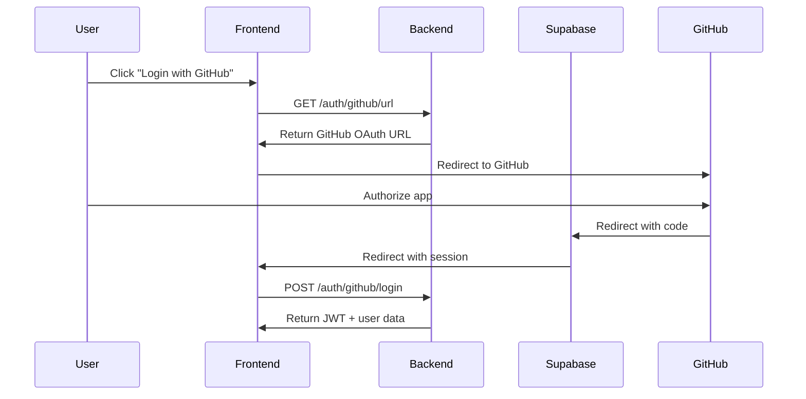

# GitHub OAuth Authentication

Autentikasi menggunakan GitHub OAuth via Supabase.

## Prerequisites

### 1. Setup GitHub OAuth App

1. Buka [GitHub Developer Settings](https://github.com/settings/developers)
2. Klik **"New OAuth App"**
3. Isi form:
   - **Application name**: Orenax Platform
   - **Homepage URL**: `http://localhost:3000` (atau production URL)
   - **Authorization callback URL**: `https://YOUR_SUPABASE_PROJECT.supabase.co/auth/v1/callback`
4. Klik **"Register application"**
5. Catat **Client ID** dan generate **Client Secret**

### 2. Configure Supabase

1. Buka Supabase Dashboard → **Authentication** → **Providers**
2. Enable **GitHub**
3. Masukkan:
   - **Client ID** dari GitHub
   - **Client Secret** dari GitHub
4. Save

---

## Endpoints

### Get GitHub OAuth URL

```http
GET /auth/github/url
```

**Query Parameters:**
| Parameter | Type | Required | Description |
|-----------|------|----------|-------------|
| `redirectTo` | string | No | URL redirect setelah login |

**Response:**
```json
{
  "url": "https://github.com/login/oauth/authorize?client_id=xxx&redirect_uri=xxx&scope=user:email",
  "provider": "github"
}
```

---

### GitHub Token Login

Untuk frontend yang sudah handle OAuth flow sendiri.

```http
POST /auth/github/login
Content-Type: application/json

{
  "accessToken": "github_oauth_access_token",
  "refreshToken": "optional_refresh_token"
}
```

**Response:**
```json
{
  "user": {
    "id": "uuid",
    "email": "user@example.com",
    "user_metadata": {
      "avatar_url": "https://avatars.githubusercontent.com/...",
      "full_name": "John Doe",
      "user_name": "johndoe"
    }
  },
  "session": {
    "access_token": "jwt_token",
    "refresh_token": "refresh_token",
    "expires_in": 3600
  }
}
```

---

## OAuth Flow



---

## Error Codes

| Code | Description |
|------|-------------|
| 400 | Invalid or missing access token |
| 401 | GitHub authentication failed |
| 500 | Internal server error |

---

## Example: Frontend Implementation

```javascript
// 1. Get OAuth URL from backend
const response = await fetch('/auth/github/url');
const { url } = await response.json();

// 2. Redirect user to GitHub
window.location.href = url;

// 3. After OAuth, Supabase redirects back with session
// Handle in callback page:
const { data: { session }, error } = await supabase.auth.getSession();

// 4. Use session for API calls
fetch('/api/v2/chat', {
  headers: {
    'Authorization': `Bearer ${session.access_token}`
  }
});
```

---

## Environment Variables

Pastikan environment variables berikut sudah di-set:

```env
SUPABASE_URL=https://your-project.supabase.co
SUPABASE_ANON_KEY=your-anon-key
SUPABASE_SERVICE_ROLE_KEY=your-service-role-key
```

> [!NOTE]
> GitHub OAuth credentials disimpan di Supabase Dashboard, bukan di environment variables backend.
