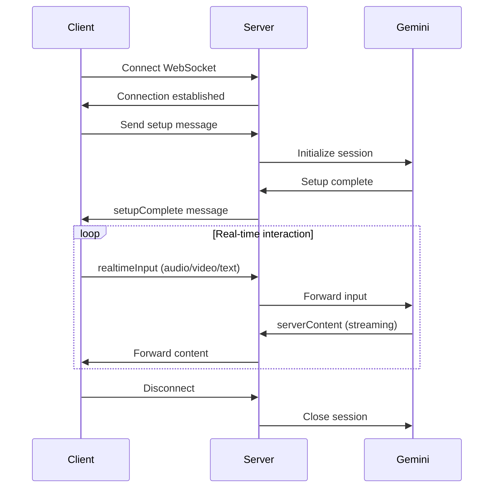

# Live API (WebSocket)

Real-time bidirectional audio/video/text interaction with Gemini using WebSockets.

## Overview

The Live API provides a stateful WebSocket connection for real-time multimodal conversations with Gemini. Unlike standard REST endpoints, this allows continuous audio/video streaming with low latency.

**Use Cases:**
- Voice assistants
- Real-time video analysis
- Live transcription
- Interactive AI agents

---

## WebSocket Connection

```javascript
const ws = new WebSocket('ws://localhost:3001/live');

ws.onopen = () => {
  console.log('Connected to Live API');
};

ws.onmessage = (event) => {
  const message = JSON.parse(event.data);
  console.log('Received:', message);
};
```

---

## Connection Flow



---

## Message Types

### Client → Server

#### 1. Setup (First Message)
```json
{
  "setup": {
    "model": "gemini-2.5-flash-native-audio-preview",
    "generationConfig": {
      "responseModalities": ["AUDIO"],
      "speechConfig": {
        "voiceConfig": {
          "prebuiltVoiceConfig": {
            "voiceName": "Kore"
          }
        }
      }
    },
    "systemInstruction": {
      "parts": [
        { "text": "You are a helpful voice assistant." }
      ]
    }
  }
}
```

#### 2. Realtime Input
```json
{
  "realtimeInput": {
    "audio": {
      "data": "base64_audio_chunk",
      "mimeType": "audio/pcm"
    }
  }
}
```

Or video:
```json
{
  "realtimeInput": {
    "video": {
      "data": "base64_video_frame",
      "mimeType": "image/jpeg"
    }
  }
}
```

Or text:
```json
{
  "realtimeInput": {
    "text": "What do you see?"
  }
}
```

#### 3. Tool Response
```json
{
  "toolResponse": {
    "functionResponses": [
      {
        "name": "get_weather",
        "response": {
          "temperature": 25,
          "conditions": "sunny"
        },
        "id": "call_abc123"
      }
    ]
  }
}
```

---

### Server → Client

#### 1. Setup Complete
```json
{
  "setupComplete": {}
}
```

#### 2. Server Content (Streaming)
```json
{
  "serverContent": {
    "modelTurn": {
      "parts": [
        {
          "inlineData": {
            "mimeType": "audio/pcm",
            "data": "base64_audio_response"
          }
        }
      ]
    },
    "turnComplete": false,
    "interrupted": false
  }
}
```

#### 3. Tool Call Request
```json
{
  "toolCall": {
    "functionCalls": [
      {
        "name": "get_weather",
        "args": {
          "location": "Jakarta"
        },
        "id": "call_abc123"
      }
    ]
  }
}
```

#### 4. Turn Complete
```json
{
  "serverContent": {
    "turnComplete": true,
    "generationComplete": true
  }
}
```

---

## Configuration Options

### Response Modalities

```json
{
  "responseModalities": ["AUDIO"]  // or ["TEXT"] or ["AUDIO", "TEXT"]
}
```

### Voice Configuration

```json
{
  "speechConfig": {
    "voiceConfig": {
      "prebuiltVoiceConfig": {
        "voiceName": "Kore"  // See TTS API for voice options
      }
    }
  }
}
```

### Automatic Activity Detection

```json
{
  "realtimeInputConfig": {
    "automaticActivityDetection": {
      "disabled": false,
      "startOfSpeechSensitivity": "START_SENSITIVITY_HIGH",
      "endOfSpeechSensitivity": "END_SENSITIVITY_HIGH",
      "prefixPaddingMs": 300,
      "silenceDurationMs": 500
    }
  }
}
```

### Activity Handling

```json
{
  "realtimeInputConfig": {
    "activityHandling": "START_OF_ACTIVITY_INTERRUPTS"  // or "NO_INTERRUPTION"
  }
}
```

---

## Audio Format

### Input Audio (Client → Server)
- **Format**: PCM (16-bit)
- **Sample Rate**: 16kHz
- **Channels**: Mono
- **Encoding**: Base64

### Output Audio (Server → Client)
- **Format**: PCM (16-bit)
- **Sample Rate**: 24kHz
- **Channels**: Mono
- **Encoding**: Base64

---

## Video Format

### Input Video (Client → Server)
- **Format**: JPEG frames
- **Resolution**: 720p or lower
- **Frame Rate**: Adaptive (recommended: 1-5 fps)
- **Encoding**: Base64

---

## Supported Models

| Model | Audio Input | Audio Output | Video Input |
|-------|-------------|--------------|-------------|
| `gemini-2.5-flash-native-audio-preview` | ✅ | ✅ | ✅ |
| `gemini-2.5-pro-native-audio-preview` | ✅ | ✅ | ✅ |

---

## Client Implementation Example

### JavaScript (Browser)

```javascript
class LiveAPIClient {
  constructor(wsUrl) {
    this.ws = new WebSocket(wsUrl);
    this.setupHandlers();
  }

  setupHandlers() {
    this.ws.onopen = () => {
      this.sendSetup();
    };

    this.ws.onmessage = (event) => {
      const message = JSON.parse(event.data);
      this.handleMessage(message);
    };
  }

  sendSetup() {
    this.ws.send(JSON.stringify({
      setup: {
        model: 'gemini-2.5-flash-native-audio-preview',
        generationConfig: {
          responseModalities: ['AUDIO'],
          speechConfig: {
            voiceConfig: {
              prebuiltVoiceConfig: { voiceName: 'Kore' }
            }
          }
        }
      }
    }));
  }

  sendAudio(audioData) {
    this.ws.send(JSON.stringify({
      realtimeInput: {
        audio: {
          data: audioData,
          mimeType: 'audio/pcm'
        }
      }
    }));
  }

  sendText(text) {
    this.ws.send(JSON.stringify({
      realtimeInput: {
        text: text
      }
    }));
  }

  handleMessage(message) {
    if (message.setupComplete) {
      console.log('Setup complete, ready for input');
    } else if (message.serverContent) {
      this.handleServerContent(message.serverContent);
    } else if (message.toolCall) {
      this.handleToolCall(message.toolCall);
    }
  }

  handleServerContent(content) {
    if (content.modelTurn?.parts) {
      for (const part of content.modelTurn.parts) {
        if (part.inlineData?.mimeType === 'audio/pcm') {
          this.playAudio(part.inlineData.data);
        } else if (part.text) {
          console.log('Text:', part.text);
        }
      }
    }
  }

  playAudio(base64Audio) {
    // Decode and play audio
    const audioData = atob(base64Audio);
    // ... play using Web Audio API
  }
}

// Usage
const client = new LiveAPIClient('ws://localhost:3001/live');
```

### Capture and Send Microphone Audio

```javascript
async function startMicrophone(client) {
  const stream = await navigator.mediaDevices.getUserMedia({ audio: true });
  const audioContext = new AudioContext({ sampleRate: 16000 });
  const source = audioContext.createMediaStreamSource(stream);
  const processor = audioContext.createScriptProcessor(4096, 1, 1);

  processor.onaudioprocess = (e) => {
    const inputData = e.inputBuffer.getChannelData(0);
    const pcm16 = float32ToPCM16(inputData);
    const base64 = arrayBufferToBase64(pcm16);
    client.sendAudio(base64);
  };

  source.connect(processor);
  processor.connect(audioContext.destination);
}

function float32ToPCM16(float32Array) {
  const pcm16 = new Int16Array(float32Array.length);
  for (let i = 0; i < float32Array.length; i++) {
    const s = Math.max(-1, Math.min(1, float32Array[i]));
    pcm16[i] = s < 0 ? s * 0x8000 : s * 0x7FFF;
  }
  return pcm16.buffer;
}

function arrayBufferToBase64(buffer) {
  let binary = '';
  const bytes = new Uint8Array(buffer);
  for (let i = 0; i < bytes.byteLength; i++) {
    binary += String.fromCharCode(bytes[i]);
  }
  return btoa(binary);
}
```

---

## Session Management

### Session Resumption

The server can provide session tokens for resuming conversations:

```json
{
  "setup": {
    "sessionResumption": {
      "handle": "previous_session_token"
    }
  }
}
```

Server will send updates:
```json
{
  "sessionResumptionUpdate": {
    "newHandle": "new_session_token",
    "resumable": true
  }
}
```

---

## Error Handling

### Connection Errors

```javascript
ws.onerror = (error) => {
  console.error('WebSocket error:', error);
};

ws.onclose = (event) => {
  console.log('Connection closed:', event.code, event.reason);
  
  if (event.code === 1006) {
    // Abnormal closure, try to reconnect
    setTimeout(() => reconnect(), 5000);
  }
};
```

### Message Errors

The server may send error messages:
```json
{
  "error": {
    "code": "INVALID_ARGUMENT",
    "message": "Audio format not supported"
  }
}
```

---

## Rate Limits

- **Max concurrent connections per user**: 5
- **Max session duration**: 60 minutes
- **Audio input rate**: Real-time (1x speed)
- **Message size**: 10MB per message

---

## Best Practices

1. **Audio Chunks**: Send audio in 100-500ms chunks for best latency
2. **Activity Detection**: Enable for voice conversations
3. **Interruption**: Allow users to interrupt AI responses
4. **Error Recovery**: Implement reconnection logic
5. **Resource Cleanup**: Close connections when done

---

## Limitations

- Audio input must be real-time (cannot be faster than 1x)
- Video frame rate should be 1-5 fps for optimal performance
- Text-only inputs and outputs also supported
- Session expires after 60 minutes of inactivity

---

## Security

WebSocket connections are authenticated using JWT:

```javascript
const ws = new WebSocket('ws://localhost:3001/live', {
  headers: {
    'Authorization': `Bearer ${jwtToken}`
  }
});
```

Or via query parameter:
```javascript
const ws = new WebSocket(`ws://localhost:3001/live?token=${jwtToken}`);
```

---

## Testing

Use `wscat` for basic testing:

```bash
npm install -g wscat

wscat -c ws://localhost:3001/live

# Send setup
> {"setup":{"model":"gemini-2.5-flash-native-audio-preview"}}

# Send text
> {"realtimeInput":{"text":"Hello!"}}
```
