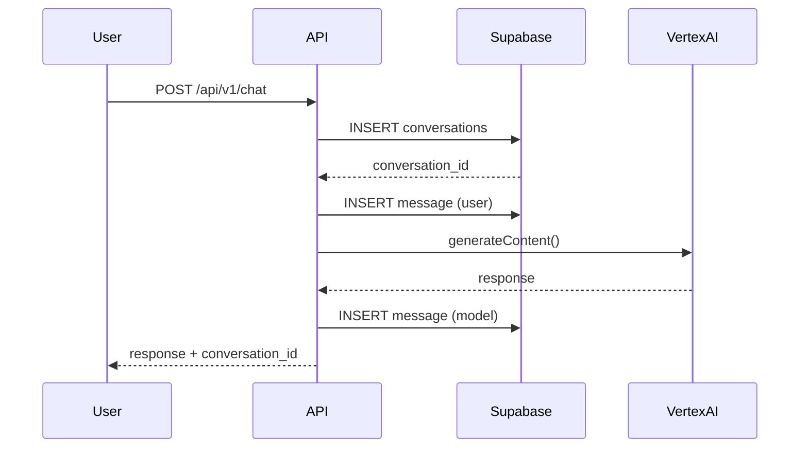
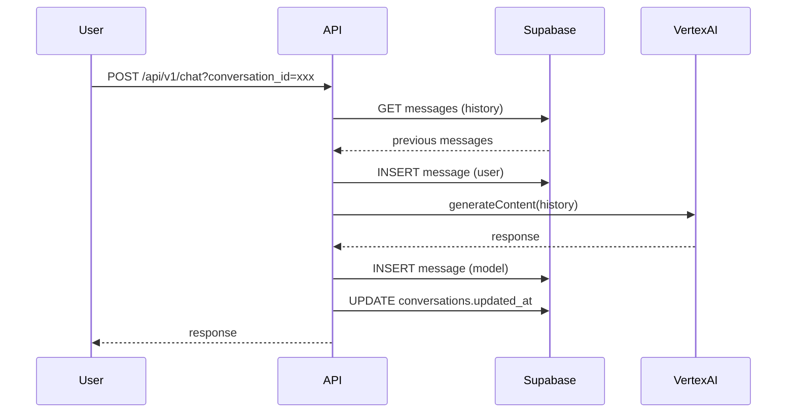

# Vertex AI Chat - Conversation Storage Guide

Panduan lengkap untuk memahami database schema dan conversation management.

## Overview

Conversation storage menggunakan **Supabase PostgreSQL** dengan Row Level Security (RLS) untuk data protection.

### Key Features
- ✅ Multi-turn conversation support
- ✅ User-specific data isolation (RLS)
- ✅ Efficient querying dengan indexes
- ✅ Automatic timestamp management
- ✅ Metadata storage untuk analytics

---

## Database Schema

### Tables

#### 1. `conversations`

Stores conversation metadata.

| Column | Type | Description |
|--------|------|-------------|
| `id` | UUID | Primary key (auto-generated) |
| `user_id` | UUID | Foreign key to `auth.users` |
| `title` | TEXT | Conversation title (first message preview) |
| `model` | TEXT | Gemini model used (e.g., `gemini-2.5-flash`) |
| `created_at` | TIMESTAMPTZ | When conversation started (auto) |
| `updated_at` | TIMESTAMPTZ | Last message timestamp (auto-updated) |

**Constraints**:
- `user_id` references `auth.users(id)` ON DELETE CASCADE
- Automatic `updated_at` trigger

**Example Data**:
```sql
{
  "id": "550e8400-e29b-41d4-a716-446655440000",
  "user_id": "123e4567-e89b-12d3-a456-426614174000",
  "title": "Halo! Siapa kamu?",
  "model": "gemini-2.5-flash",
  "created_at": "2025-12-02T10:00:00Z",
  "updated_at": "2025-12-02T10:05:00Z"
}
```

#### 2. `messages`

Stores individual messages within conversations.

| Column | Type | Description |
|--------|------|-------------|
| `id` | UUID | Primary key (auto-generated) |
| `conversation_id` | UUID | Foreign key to `conversations` |
| `role` | TEXT | Either 'user' or 'model' |
| `content` | TEXT | Message text content |
| `metadata` | JSONB | Additional data (tokens, finish_reason, etc.) |
| `created_at` | TIMESTAMPTZ | Message timestamp (auto) |

**Constraints**:
- `conversation_id` references `conversations(id)` ON DELETE CASCADE
- `role` CHECK constraint: `role IN ('user', 'model')`

**Example Data**:
```sql
{
  "id": "660e8400-e29b-41d4-a716-446655440000",
  "conversation_id": "550e8400-e29b-41d4-a716-446655440000",
  "role": "user",
  "content": "Halo! Siapa kamu?",
  "metadata": null,
  "created_at": "2025-12-02T10:00:00Z"
}

{
  "id": "770e8400-e29b-41d4-a716-446655440000",
  "conversation_id": "550e8400-e29b-41d4-a716-446655440000",
  "role": "model",
  "content": "Halo! Saya OrenaX Agent...",
  "metadata": {
    "finishReason": "STOP",
    "usageMetadata": {
      "promptTokenCount": 25,
      "candidatesTokenCount": 45,
      "totalTokenCount": 70
    }
  },
  "created_at": "2025-12-02T10:00:05Z"
}
```

---

## Indexes

For optimal query performance:

```sql
CREATE INDEX idx_conversations_user_id ON conversations(user_id);
CREATE INDEX idx_conversations_updated_at ON conversations(updated_at DESC);
CREATE INDEX idx_messages_conversation_id ON messages(conversation_id);
CREATE INDEX idx_messages_created_at ON messages(created_at ASC);
```

**Query Patterns**:
- `idx_conversations_user_id`: List conversations untuk user
- `idx_conversations_updated_at`: Sort by latest activity
- `idx_messages_conversation_id`: Get conversation history
- `idx_messages_created_at`: Order messages chronologically

---

## Row Level Security (RLS)

### Policy Summary

**conversations table**:
- Users can SELECT/INSERT/UPDATE/DELETE **only their own** conversations
- Based on `auth.uid() = user_id`

**messages table**:
- Users can SELECT/INSERT/UPDATE/DELETE messages **only from their conversations**
- Based on JOIN with `conversations` table

### Policy Examples

```sql
-- SELECT policy for conversations
CREATE POLICY conversations_select_policy ON conversations
  FOR SELECT
  USING (auth.uid() = user_id);

-- INSERT policy for messages
CREATE POLICY messages_insert_policy ON messages
  FOR INSERT
  WITH CHECK (
    EXISTS (
      SELECT 1 FROM conversations
      WHERE conversations.id = messages.conversation_id
      AND conversations.user_id = auth.uid()
    )
  );
```

> [!IMPORTANT]
> RLS policies ensure complete data isolation between users

---

## Common Queries

### Create New Conversation

```typescript
const { data, error } = await supabase
  .from('conversations')
  .insert({
    user_id: userId,
    model: 'gemini-2.5-flash',
    title: 'New Chat',
  })
  .select('id')
  .single();
```

### Add Message to Conversation

```typescript
await supabase
  .from('messages')
  .insert({
    conversation_id: conversationId,
    role: 'user',
    content: messageContent,
  });
```

### Get Conversation History

```typescript
const { data: messages } = await supabase
  .from('messages')
  .select('role, content')
  .eq('conversation_id', conversationId)
  .order('created_at', { ascending: true });
```

### List User Conversations

```typescript
const { data: conversations } = await supabase
  .from('conversations')
  .select('id, title, model, created_at, updated_at')
  .eq('user_id', userId)
  .order('updated_at', { ascending: false });
 ```

### Delete Conversation (with messages)

```typescript
// CASCADE delete automatically removes messages
await supabase
  .from('conversations')
  .delete()
  .eq('id', conversationId)
  .eq('user_id', userId);
```

---

## Metadata Structure

### Message Metadata

Stored in `messages.metadata` (JSONB):

```json
{
  "finishReason": "STOP",
  "usageMetadata": {
    "promptTokenCount": 25,
    "candidatesTokenCount": 45,
    "totalTokenCount": 70
  },
  "safetyRatings": [...],
  "citationMetadata": {...}
}
```

**Common Fields**:
- `finishReason`: Why generation stopped (STOP, MAX_TOKENS, SAFETY, etc.)
- `usageMetadata.tokencount`: Token usage for cost tracking
- `safetyRatings`: Content safety classifications
- `citationMetadata`: Source citations jika ada

---

## Data Lifecycle

### 1. Create Conversation



### 2. Continue Conversation



---

## Analytics Queries

### Token Usage per User

```sql
SELECT 
  c.user_id,
  SUM((m.metadata->>'usageMetadata'->'totalTokenCount')::int) as total_tokens
FROM messages m
JOIN conversations c ON c.id = m.conversation_id
WHERE m.metadata IS NOT NULL
GROUP BY c.user_id;
```

### Most Active Users

```sql
SELECT 
  user_id,
  COUNT(DISTINCT id) as conversation_count,
  COUNT(*) as message_count
FROM conversations c
JOIN messages m ON m.conversation_id = c.id
GROUP BY user_id
ORDER BY message_count DESC
LIMIT 10;
```

### Model Usage Distribution

```sql
SELECT 
  model,
  COUNT(*) as usage_count
FROM conversations
GROUP BY model
ORDER BY usage_count DESC;
```

---

## Backup & Restore

### Backup Conversations

```bash
# Export to JSON
supabase db dump --table=conversations > conversations_backup.sql
supabase db dump --table=messages > messages_backup.sql
```

### Restore from Backup

```bash
psql -h db.YOUR_PROJECT.supabase.co -U postgres -d postgres -f conversations_backup.sql
```

---

## Data Retention

### Recommended Policies

1. **Active Conversations**: Keep indefinitely jika user aktif
2. **Inactive**: Archive setelah 90 hari tidak ada activity
3. **Deleted**: Soft delete dengan `deleted_at` timestamp (opsional)

### Cleanup Query

```sql
-- Delete conversations older than 90 days with no activity
DELETE FROM conversations
WHERE updated_at < NOW() - INTERVAL '90 days';
```

> [!WARNING]
> Pastikan backup sebelum delete data!

---

## Performance Optimization

### Tips
- ✅ Use `created_at` index untuk chronological queries
- ✅ Limit conversation history fetch (e.g., last 50 messages)
- ✅ Use pagination untuk list conversations
- ✅ Cache frequently accessed conversations
- ✅ Consider archiving old conversations

### Query Optimization Example

```typescript
// Instead of fetching all messages:
// ❌ BAD
const allMessages = await supabase
  .from('messages')
  .select('*')
  .eq('conversation_id', id);

// ✅ GOOD - Limit to recent messages
const recentMessages = await supabase
  .from('messages')
  .select('role, content')
  .eq('conversation_id', id)
  .order('created_at', { ascending: false })
  .limit(50);
```

---

## Security Best Practices

### ✅ DO:
- Always use RLS policies
- Validate `conversation_id` belongs to authenticated user
- Sanitize user input sebelum store
- Use prepared statements (Supabase handles this)
- Monitor for unusual activity patterns
- Regular security audits

### ❌ DON'T:
- Store PII (Personally Identifiable Information) unnecessarily
- Disable RLS policies
- Use raw SQL with user input
- Share conversation IDs between users
- Store API keys dalam messages

---

## Migration Guide

Jika perlu update schema:

```sql
-- Example: Add new column
ALTER TABLE conversations
ADD COLUMN tags TEXT[];

-- Example: Add constraint
ALTER TABLE messages
ADD CONSTRAINT check_content_length 
CHECK (length(content) > 0);
```

Run migrations via Supabase Dashboard → SQL Editor.

---

## Monitoring

### Metrics to Track
- 📊 Total conversations created per day
- 📊 Average messages per conversation
- 📊 Token usage per user/model
- 📊 Database size growth
- 📊 Query performance (slow queries)

### Supabase Monitoring

1. Dashboard → **Database** → **Logs**
2. Monitor slow queries
3. Check table sizes
4. Review index usage

---

## Next Steps

Database setup complete! Continue with:
- 🔧 [Setup Guide](./vertex-ai-setup.md) - Google Cloud configuration
- 📖 [API Documentation](./api-chat.md) - API reference
- 🧪 [Testing Guide](./api-testing-chat.md) - Test endpoints
