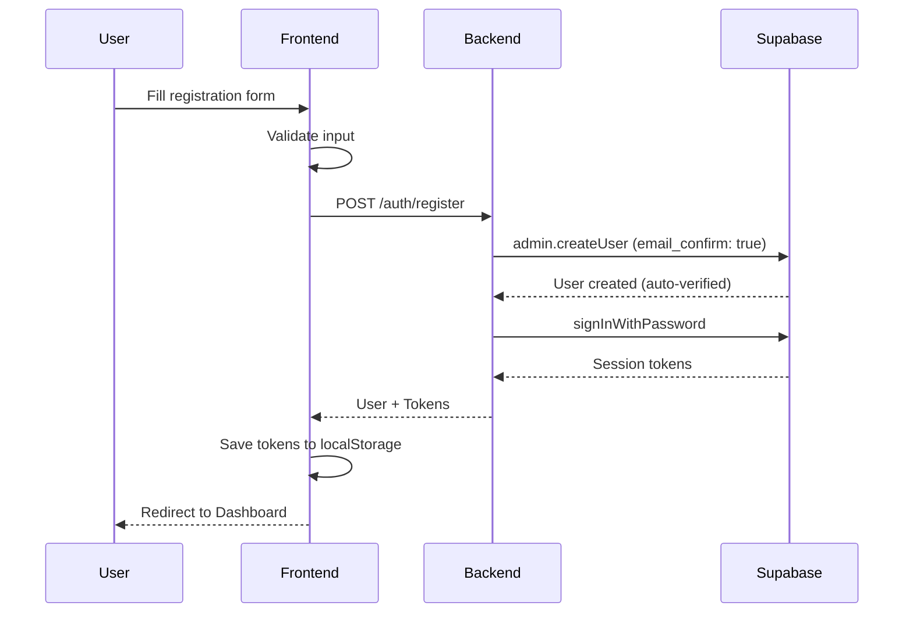
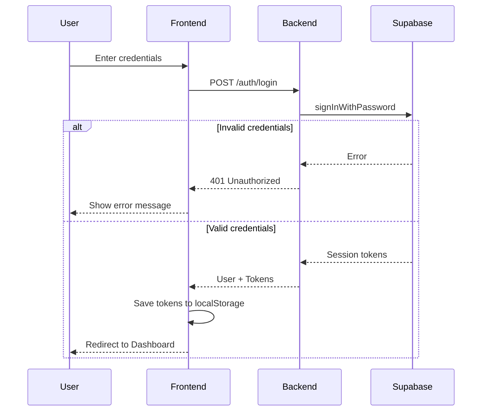
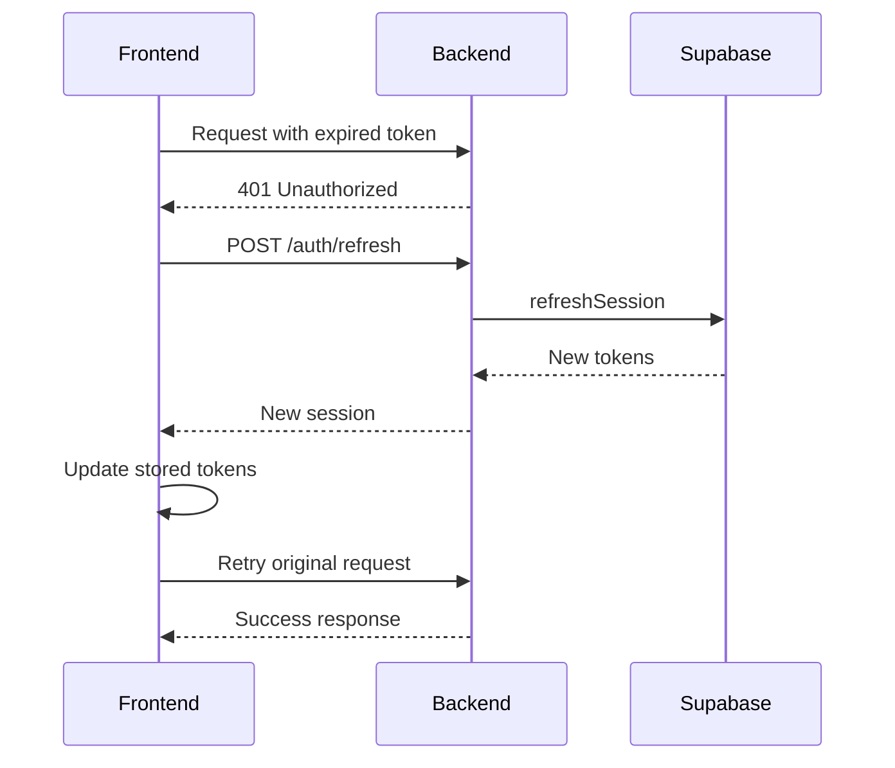

# 📝 Email Signup - Frontend Implementation Guide

> **Complete tutorial for implementing email/password registration with OrenaX Backend API**

## Table of Contents
1. [Overview](#overview)
2. [Backend Behavior Analysis](#backend-behavior-analysis)
3. [API Specification](#api-specification)
4. [Frontend Implementation (Vite + TSX)](#frontend-implementation-vite--tsx)
5. [Complete Flow Diagrams](#complete-flow-diagrams)
6. [Error Handling](#error-handling)
7. [Best Practices](#best-practices)

---

## Overview

### Base URL
- **Development**: `http://localhost:3001`
- **Production**: `https://your-backend-domain.com`

### Authentication Flow
```
User → Register → Auto Login → Get Tokens → Access Protected Resources
```

> [!IMPORTANT]
> Backend saat ini menggunakan **Supabase Admin API** dengan `email_confirm: true` yang artinya:
> - Email TIDAK dikirim untuk konfirmasi
> - User langsung ter-verified setelah register
> - Bisa register dengan email sembarang (selama format valid)

---

## Backend Behavior Analysis

### Current Implementation Issue

Backend menggunakan 2 mode registrasi:

#### Mode 1: Admin API (Default - SAAT INI AKTIF)
```typescript
// Jika SUPABASE_SERVICE_ROLE_KEY tersedia:
await supabaseAdmin.auth.admin.createUser({
    email,
    password,
    email_confirm: true, // ⚠️ AUTO CONFIRM - tidak kirim email
    user_metadata: { name: finalName }
});
```

**Dampak:**
- ✅ User langsung bisa login setelah register
- ❌ Email konfirmasi TIDAK dikirim
- ❌ Bisa register dengan email fake

#### Mode 2: Standard SignUp (Fallback)
```typescript
// Jika SUPABASE_SERVICE_ROLE_KEY TIDAK tersedia:
await supabase.auth.signUp({
    email,
    password,
    options: { data: { name: finalName } },
});
```

**Dampak:**
- ✅ Email konfirmasi DIKIRIM
- ⚠️ User harus confirm email sebelum bisa login
- ✅ Lebih secure

### Rekomendasi untuk Production

Untuk mengaktifkan email verification yang sebenarnya:

1. **Hapus/Kosongkan** `SUPABASE_SERVICE_ROLE_KEY` dari environment
2. Atau ubah kode backend untuk TIDAK menggunakan `email_confirm: true`
3. Konfigurasi SMTP di Supabase Dashboard

---

## API Specification

### 1. Register (POST /auth/register)

#### Request
```http
POST /auth/register
Content-Type: application/json

{
  "email": "user@example.com",
  "password": "securePassword123",
  "name": "John Doe"
}
```

#### Request Body Schema
| Field | Type | Required | Validation |
|-------|------|----------|------------|
| `email` | string | ✅ Yes | Must be valid email format |
| `password` | string | ✅ Yes | Minimum 6 characters |
| `name` | string | ⚠️ Required* | Minimum 2 characters |
| `fullName` | string | ⚠️ Alternative* | Minimum 2 characters |

> *Either `name` or `fullName` must be provided

#### Success Response (201 Created)
> [!NOTE]
> Since email verification is now required, no `accessToken` or `session` is returned.
> The frontend should redirect the user to a "Check Email" page.

```json
{
  "message": "Registration successful. Please check your email for verification link.",
  "user": {
    "id": "550e8400-e29b-41d4-a716-446655440000",
    "email": "user@example.com",
    "name": "John Doe",
    "fullName": "John Doe",
    "emailVerified": false
  },
  "requireVerification": true
}
```

#### Error Responses

**400 Bad Request - Validation Error**
```json
{
  "statusCode": 400,
  "message": ["email must be an email", "password must be longer than or equal to 6 characters"],
  "error": "Bad Request"
}
```

**400 Bad Request - Name Required**
```json
{
  "statusCode": 400,
  "message": "Name is required",
  "error": "Bad Request"
}
```

**400 Bad Request - Email Already Exists**
```json
{
  "statusCode": 400,
  "message": "User already registered",
  "error": "Bad Request"
}
```

---

### 2. Login (POST /auth/login)

#### Request
```http
POST /auth/login
Content-Type: application/json

{
  "email": "user@example.com",
  "password": "securePassword123"
}
```

#### Success Response (200 OK)
```json
{
  "message": "Login successful",
  "user": {
    "id": "550e8400-e29b-41d4-a716-446655440000",
    "email": "user@example.com",
    "name": "John Doe",
    "fullName": "John Doe"
  },
  "accessToken": "eyJhbGciOiJIUzI1NiIsInR5cCI6IkpXVCJ9...",
  "refreshToken": "v1.refresh_token_here...",
  "expiresIn": 3600,
  "expiresAt": 1703356800,
  "session": { ... }
}
```

#### Error Responses

**401 Unauthorized - Invalid Credentials**
```json
{
  "statusCode": 401,
  "message": "Invalid login credentials",
  "error": "Unauthorized"
}
```

**401 Unauthorized - Email Not Confirmed**
```json
{
  "statusCode": 401,
  "message": "Email not confirmed",
  "error": "Unauthorized"
}
```

---

### 3. Get Current User (GET /auth/me)

#### Request
```http
GET /auth/me
Authorization: Bearer <access_token>
```

#### Success Response (200 OK)
```json
{
  "user": {
    "id": "550e8400-e29b-41d4-a716-446655440000",
    "email": "user@example.com",
    "name": "John Doe",
    "emailVerified": true
  }
}
```

---

### 4. Refresh Token (POST /auth/refresh)

#### Request
```http
POST /auth/refresh
Content-Type: application/json

{
  "refreshToken": "v1.refresh_token_here..."
}
```

#### Success Response (200 OK)
```json
{
  "message": "Token refreshed successfully",
  "session": {
    "access_token": "new_access_token...",
    "refresh_token": "new_refresh_token...",
    "expires_in": 3600,
    "expires_at": 1703360400
  }
}
```

---

### 5. Logout (POST /auth/logout)

#### Request
```http
POST /auth/logout
Authorization: Bearer <access_token>
```

#### Success Response (200 OK)
```json
{
  "message": "Logout successful"
}
```

---

### 6. Forgot Password (POST /auth/forgot-password)

#### Request
```http
POST /auth/forgot-password
Content-Type: application/json

{
  "email": "user@example.com",
  "redirectTo": "https://yourapp.com/reset-password"
}
```

#### Success Response (200 OK)
```json
{
  "message": "If an account exists with this email, you will receive a password reset link.",
  "success": true
}
```

---

### 7. Update Password (POST /auth/update-password)

#### Request
```http
POST /auth/update-password
Content-Type: application/json

{
  "accessToken": "token_from_reset_email_url",
  "newPassword": "newSecurePassword123"
}
```

#### Success Response (200 OK)
```json
{
  "message": "Password updated successfully",
  "success": true
}
```

---

## Frontend Implementation (Vite + TSX)

### Project Setup

```bash
# Create Vite project
npm create vite@latest my-app -- --template react-ts
cd my-app
npm install

# Install dependencies
npm install axios react-router-dom @types/react-router-dom
```

### 1. API Client Configuration

**`src/api/config.ts`**
```typescript
import axios from 'axios';

// Base API configuration
export const API_BASE_URL = import.meta.env.VITE_API_URL || 'http://localhost:3001';

// Create axios instance
export const api = axios.create({
  baseURL: API_BASE_URL,
  headers: {
    'Content-Type': 'application/json',
  },
});

// Add token interceptor
api.interceptors.request.use((config) => {
  const token = localStorage.getItem('accessToken');
  if (token) {
    config.headers.Authorization = `Bearer ${token}`;
  }
  return config;
});

// Add response interceptor for token refresh
api.interceptors.response.use(
  (response) => response,
  async (error) => {
    const originalRequest = error.config;
    
    if (error.response?.status === 401 && !originalRequest._retry) {
      originalRequest._retry = true;
      
      try {
        const refreshToken = localStorage.getItem('refreshToken');
        if (refreshToken) {
          const response = await axios.post(`${API_BASE_URL}/auth/refresh`, {
            refreshToken,
          });
          
          const { session } = response.data;
          localStorage.setItem('accessToken', session.access_token);
          localStorage.setItem('refreshToken', session.refresh_token);
          
          originalRequest.headers.Authorization = `Bearer ${session.access_token}`;
          return api(originalRequest);
        }
      } catch (refreshError) {
        // Refresh failed, clear tokens and redirect to login
        localStorage.removeItem('accessToken');
        localStorage.removeItem('refreshToken');
        window.location.href = '/login';
      }
    }
    
    return Promise.reject(error);
  }
);
```

### 2. Auth Types

**`src/types/auth.ts`**
```typescript
export interface User {
  id: string;
  email: string;
  name?: string;
  fullName?: string;
  emailVerified?: boolean;
  avatarUrl?: string;
}

export interface AuthSession {
  access_token: string;
  refresh_token: string;
  expires_in: number;
  expires_at: number;
  token_type: string;
}

export interface RegisterRequest {
  email: string;
  password: string;
  name: string;
}

export interface LoginRequest {
  email: string;
  password: string;
}

export interface AuthResponse {
  message: string;
  user: User;
  accessToken: string;
  refreshToken: string;
  expiresIn: number;
  expiresAt: number;
  session: AuthSession;
}

export interface ApiError {
  statusCode: number;
  message: string | string[];
  error: string;
}
```

### 3. Auth Service

**`src/services/authService.ts`**
```typescript
import { api } from '../api/config';
import type { 
  RegisterRequest, 
  LoginRequest, 
  AuthResponse, 
  User 
} from '../types/auth';

class AuthService {
  /**
   * Register a new user
   */
  async register(data: RegisterRequest): Promise<AuthResponse> {
    const response = await api.post<AuthResponse>('/auth/register', data);
    this.saveTokens(response.data);
    return response.data;
  }

  /**
   * Login with email and password
   */
  async login(data: LoginRequest): Promise<AuthResponse> {
    const response = await api.post<AuthResponse>('/auth/login', data);
    this.saveTokens(response.data);
    return response.data;
  }

  /**
   * Get current authenticated user
   */
  async getCurrentUser(): Promise<{ user: User }> {
    const response = await api.get<{ user: User }>('/auth/me');
    return response.data;
  }

  /**
   * Logout current user
   */
  async logout(): Promise<void> {
    try {
      await api.post('/auth/logout');
    } catch (error) {
      // Ignore logout errors, clear local state anyway
      console.warn('Logout API error:', error);
    } finally {
      this.clearTokens();
    }
  }

  /**
   * Request password reset email
   */
  async forgotPassword(email: string, redirectTo?: string): Promise<void> {
    await api.post('/auth/forgot-password', { email, redirectTo });
  }

  /**
   * Update password with reset token
   */
  async updatePassword(accessToken: string, newPassword: string): Promise<void> {
    await api.post('/auth/update-password', { accessToken, newPassword });
  }

  /**
   * Refresh access token
   */
  async refreshToken(): Promise<AuthResponse> {
    const refreshToken = localStorage.getItem('refreshToken');
    if (!refreshToken) {
      throw new Error('No refresh token available');
    }
    
    const response = await api.post<{ session: AuthResponse['session'] }>('/auth/refresh', {
      refreshToken,
    });
    
    const { session } = response.data;
    localStorage.setItem('accessToken', session.access_token);
    localStorage.setItem('refreshToken', session.refresh_token);
    
    return response.data as unknown as AuthResponse;
  }

  /**
   * Check if user is authenticated
   */
  isAuthenticated(): boolean {
    return !!localStorage.getItem('accessToken');
  }

  /**
   * Get stored access token
   */
  getAccessToken(): string | null {
    return localStorage.getItem('accessToken');
  }

  // Private methods
  private saveTokens(data: AuthResponse): void {
    localStorage.setItem('accessToken', data.accessToken);
    localStorage.setItem('refreshToken', data.refreshToken);
    localStorage.setItem('user', JSON.stringify(data.user));
  }

  private clearTokens(): void {
    localStorage.removeItem('accessToken');
    localStorage.removeItem('refreshToken');
    localStorage.removeItem('user');
  }
}

export const authService = new AuthService();
```

### 4. Auth Context

**`src/context/AuthContext.tsx`**
```tsx
import React, { createContext, useContext, useState, useEffect, useCallback } from 'react';
import type { User } from '../types/auth';
import { authService } from '../services/authService';

interface AuthContextType {
  user: User | null;
  isLoading: boolean;
  isAuthenticated: boolean;
  login: (email: string, password: string) => Promise<void>;
  register: (email: string, password: string, name: string) => Promise<void>;
  logout: () => Promise<void>;
  refreshUser: () => Promise<void>;
}

const AuthContext = createContext<AuthContextType | undefined>(undefined);

export function AuthProvider({ children }: { children: React.ReactNode }) {
  const [user, setUser] = useState<User | null>(null);
  const [isLoading, setIsLoading] = useState(true);

  // Initialize auth state
  useEffect(() => {
    const initAuth = async () => {
      if (authService.isAuthenticated()) {
        try {
          const { user } = await authService.getCurrentUser();
          setUser(user);
        } catch (error) {
          console.error('Failed to get current user:', error);
          await authService.logout();
        }
      }
      setIsLoading(false);
    };

    initAuth();
  }, []);

  const login = useCallback(async (email: string, password: string) => {
    const response = await authService.login({ email, password });
    setUser(response.user);
  }, []);

  const register = useCallback(async (email: string, password: string, name: string) => {
    const response = await authService.register({ email, password, name });
    setUser(response.user);
  }, []);

  const logout = useCallback(async () => {
    await authService.logout();
    setUser(null);
  }, []);

  const refreshUser = useCallback(async () => {
    if (authService.isAuthenticated()) {
      const { user } = await authService.getCurrentUser();
      setUser(user);
    }
  }, []);

  const value: AuthContextType = {
    user,
    isLoading,
    isAuthenticated: !!user,
    login,
    register,
    logout,
    refreshUser,
  };

  return <AuthContext.Provider value={value}>{children}</AuthContext.Provider>;
}

export function useAuth() {
  const context = useContext(AuthContext);
  if (context === undefined) {
    throw new Error('useAuth must be used within an AuthProvider');
  }
  return context;
}
```

### 5. Register Component

**`src/components/auth/RegisterForm.tsx`**
```tsx
import React, { useState } from 'react';
import { useNavigate, Link } from 'react-router-dom';
import { useAuth } from '../../context/AuthContext';
import type { ApiError } from '../../types/auth';
import './AuthForm.css';

export function RegisterForm() {
  const navigate = useNavigate();
  const { register } = useAuth();
  
  const [formData, setFormData] = useState({
    name: '',
    email: '',
    password: '',
    confirmPassword: '',
  });
  const [errors, setErrors] = useState<string[]>([]);
  const [isLoading, setIsLoading] = useState(false);

  const handleChange = (e: React.ChangeEvent<HTMLInputElement>) => {
    setFormData((prev) => ({
      ...prev,
      [e.target.name]: e.target.value,
    }));
    setErrors([]);
  };

  const validateForm = (): boolean => {
    const newErrors: string[] = [];

    if (!formData.name.trim()) {
      newErrors.push('Name is required');
    } else if (formData.name.length < 2) {
      newErrors.push('Name must be at least 2 characters');
    }

    if (!formData.email.trim()) {
      newErrors.push('Email is required');
    } else if (!/^[^\s@]+@[^\s@]+\.[^\s@]+$/.test(formData.email)) {
      newErrors.push('Please enter a valid email address');
    }

    if (!formData.password) {
      newErrors.push('Password is required');
    } else if (formData.password.length < 6) {
      newErrors.push('Password must be at least 6 characters');
    }

    if (formData.password !== formData.confirmPassword) {
      newErrors.push('Passwords do not match');
    }

    setErrors(newErrors);
    return newErrors.length === 0;
  };

  const handleSubmit = async (e: React.FormEvent) => {
    e.preventDefault();
    
    if (!validateForm()) {
      return;
    }

    setIsLoading(true);
    setErrors([]);

    try {
      const response = await register(formData.email, formData.password, formData.name);
      
      // Check if verification is required
      if (response.requireVerification) {
        // Redirect to a check-email page or show success message
        // navigate('/check-email', { state: { email: formData.email } });
        alert('Please check your email to verify your account!');
        navigate('/login');
      } else {
        navigate('/dashboard');
      }
    } catch (error: any) {
      const apiError = error.response?.data as ApiError;
      if (apiError?.message) {
        setErrors(Array.isArray(apiError.message) ? apiError.message : [apiError.message]);
      } else {
        setErrors(['Registration failed. Please try again.']);
      }
    } finally {
      setIsLoading(false);
    }
  };

  return (
    <div className="auth-form-container">
      <form onSubmit={handleSubmit} className="auth-form">
        <h2>Create Account</h2>
        <p className="auth-subtitle">Sign up to get started</p>

        {errors.length > 0 && (
          <div className="error-container">
            {errors.map((error, index) => (
              <p key={index} className="error-message">{error}</p>
            ))}
          </div>
        )}

        <div className="form-group">
          <label htmlFor="name">Full Name</label>
          <input
            type="text"
            id="name"
            name="name"
            value={formData.name}
            onChange={handleChange}
            placeholder="Enter your full name"
            autoComplete="name"
            disabled={isLoading}
          />
        </div>

        <div className="form-group">
          <label htmlFor="email">Email Address</label>
          <input
            type="email"
            id="email"
            name="email"
            value={formData.email}
            onChange={handleChange}
            placeholder="Enter your email"
            autoComplete="email"
            disabled={isLoading}
          />
        </div>

        <div className="form-group">
          <label htmlFor="password">Password</label>
          <input
            type="password"
            id="password"
            name="password"
            value={formData.password}
            onChange={handleChange}
            placeholder="Create a password (min. 6 characters)"
            autoComplete="new-password"
            disabled={isLoading}
          />
        </div>

        <div className="form-group">
          <label htmlFor="confirmPassword">Confirm Password</label>
          <input
            type="password"
            id="confirmPassword"
            name="confirmPassword"
            value={formData.confirmPassword}
            onChange={handleChange}
            placeholder="Re-enter your password"
            autoComplete="new-password"
            disabled={isLoading}
          />
        </div>

        <button 
          type="submit" 
          className="submit-button"
          disabled={isLoading}
        >
          {isLoading ? 'Creating Account...' : 'Create Account'}
        </button>

        <p className="auth-footer">
          Already have an account? <Link to="/login">Sign in</Link>
        </p>
      </form>
    </div>
  );
}
```

### 6. Login Component

**`src/components/auth/LoginForm.tsx`**
```tsx
import React, { useState } from 'react';
import { useNavigate, Link } from 'react-router-dom';
import { useAuth } from '../../context/AuthContext';
import type { ApiError } from '../../types/auth';
import './AuthForm.css';

export function LoginForm() {
  const navigate = useNavigate();
  const { login } = useAuth();
  
  const [formData, setFormData] = useState({
    email: '',
    password: '',
  });
  const [error, setError] = useState<string | null>(null);
  const [isLoading, setIsLoading] = useState(false);

  const handleChange = (e: React.ChangeEvent<HTMLInputElement>) => {
    setFormData((prev) => ({
      ...prev,
      [e.target.name]: e.target.value,
    }));
    setError(null);
  };

  const handleSubmit = async (e: React.FormEvent) => {
    e.preventDefault();
    
    if (!formData.email || !formData.password) {
      setError('Please fill in all fields');
      return;
    }

    setIsLoading(true);
    setError(null);

    try {
      await login(formData.email, formData.password);
      navigate('/dashboard');
    } catch (err: any) {
      const apiError = err.response?.data as ApiError;
      setError(
        Array.isArray(apiError?.message) 
          ? apiError.message[0] 
          : apiError?.message || 'Login failed. Please check your credentials.'
      );
    } finally {
      setIsLoading(false);
    }
  };

  return (
    <div className="auth-form-container">
      <form onSubmit={handleSubmit} className="auth-form">
        <h2>Welcome Back</h2>
        <p className="auth-subtitle">Sign in to your account</p>

        {error && (
          <div className="error-container">
            <p className="error-message">{error}</p>
          </div>
        )}

        <div className="form-group">
          <label htmlFor="email">Email Address</label>
          <input
            type="email"
            id="email"
            name="email"
            value={formData.email}
            onChange={handleChange}
            placeholder="Enter your email"
            autoComplete="email"
            disabled={isLoading}
          />
        </div>

        <div className="form-group">
          <label htmlFor="password">Password</label>
          <input
            type="password"
            id="password"
            name="password"
            value={formData.password}
            onChange={handleChange}
            placeholder="Enter your password"
            autoComplete="current-password"
            disabled={isLoading}
          />
        </div>

        <div className="form-options">
          <Link to="/forgot-password" className="forgot-link">
            Forgot password?
          </Link>
        </div>

        <button 
          type="submit" 
          className="submit-button"
          disabled={isLoading}
        >
          {isLoading ? 'Signing in...' : 'Sign In'}
        </button>

        <p className="auth-footer">
          Don't have an account? <Link to="/register">Sign up</Link>
        </p>
      </form>
    </div>
  );
}
```

### 7. CSS Styles

**`src/components/auth/AuthForm.css`**
```css
.auth-form-container {
  display: flex;
  justify-content: center;
  align-items: center;
  min-height: 100vh;
  padding: 20px;
  background: linear-gradient(135deg, #667eea 0%, #764ba2 100%);
}

.auth-form {
  width: 100%;
  max-width: 400px;
  padding: 40px;
  background: white;
  border-radius: 16px;
  box-shadow: 0 20px 40px rgba(0, 0, 0, 0.15);
}

.auth-form h2 {
  margin: 0 0 8px;
  font-size: 28px;
  font-weight: 700;
  color: #1a1a2e;
  text-align: center;
}

.auth-subtitle {
  margin: 0 0 32px;
  color: #666;
  text-align: center;
  font-size: 14px;
}

.form-group {
  margin-bottom: 20px;
}

.form-group label {
  display: block;
  margin-bottom: 6px;
  font-weight: 500;
  font-size: 14px;
  color: #333;
}

.form-group input {
  width: 100%;
  padding: 12px 16px;
  border: 2px solid #e1e4e8;
  border-radius: 8px;
  font-size: 16px;
  transition: all 0.2s ease;
  box-sizing: border-box;
}

.form-group input:focus {
  outline: none;
  border-color: #667eea;
  box-shadow: 0 0 0 3px rgba(102, 126, 234, 0.1);
}

.form-group input:disabled {
  background: #f5f5f5;
  cursor: not-allowed;
}

.error-container {
  padding: 12px 16px;
  margin-bottom: 20px;
  background: #fff5f5;
  border: 1px solid #feb2b2;
  border-radius: 8px;
}

.error-message {
  margin: 0;
  color: #c53030;
  font-size: 14px;
}

.error-message + .error-message {
  margin-top: 4px;
}

.form-options {
  display: flex;
  justify-content: flex-end;
  margin-bottom: 20px;
}

.forgot-link {
  color: #667eea;
  font-size: 14px;
  text-decoration: none;
}

.forgot-link:hover {
  text-decoration: underline;
}

.submit-button {
  width: 100%;
  padding: 14px;
  background: linear-gradient(135deg, #667eea 0%, #764ba2 100%);
  color: white;
  border: none;
  border-radius: 8px;
  font-size: 16px;
  font-weight: 600;
  cursor: pointer;
  transition: all 0.2s ease;
}

.submit-button:hover:not(:disabled) {
  transform: translateY(-2px);
  box-shadow: 0 4px 12px rgba(102, 126, 234, 0.4);
}

.submit-button:disabled {
  opacity: 0.7;
  cursor: not-allowed;
}

.auth-footer {
  margin: 24px 0 0;
  text-align: center;
  font-size: 14px;
  color: #666;
}

.auth-footer a {
  color: #667eea;
  font-weight: 600;
  text-decoration: none;
}

.auth-footer a:hover {
  text-decoration: underline;
}
```

### 8. Protected Route Component

**`src/components/ProtectedRoute.tsx`**
```tsx
import { Navigate, useLocation } from 'react-router-dom';
import { useAuth } from '../context/AuthContext';

interface ProtectedRouteProps {
  children: React.ReactNode;
}

export function ProtectedRoute({ children }: ProtectedRouteProps) {
  const { isAuthenticated, isLoading } = useAuth();
  const location = useLocation();

  if (isLoading) {
    return (
      <div className="loading-container">
        <div className="loading-spinner" />
        <p>Loading...</p>
      </div>
    );
  }

  if (!isAuthenticated) {
    // Redirect to login, saving the attempted URL
    return <Navigate to="/login" state={{ from: location }} replace />;
  }

  return <>{children}</>;
}
```

### 9. App Setup

**`src/App.tsx`**
```tsx
import { BrowserRouter, Routes, Route, Navigate } from 'react-router-dom';
import { AuthProvider } from './context/AuthContext';
import { ProtectedRoute } from './components/ProtectedRoute';
import { LoginForm } from './components/auth/LoginForm';
import { RegisterForm } from './components/auth/RegisterForm';
import { Dashboard } from './pages/Dashboard';

function App() {
  return (
    <BrowserRouter>
      <AuthProvider>
        <Routes>
          {/* Public routes */}
          <Route path="/login" element={<LoginForm />} />
          <Route path="/register" element={<RegisterForm />} />
          
          {/* Protected routes */}
          <Route
            path="/dashboard"
            element={
              <ProtectedRoute>
                <Dashboard />
              </ProtectedRoute>
            }
          />
          
          {/* Redirect root to dashboard */}
          <Route path="/" element={<Navigate to="/dashboard" replace />} />
          
          {/* 404 */}
          <Route path="*" element={<Navigate to="/login" replace />} />
        </Routes>
      </AuthProvider>
    </BrowserRouter>
  );
}

export default App;
```

### 10. Environment Configuration

**`.env`**
```env
VITE_API_URL=http://localhost:3001
```

**`.env.production`**
```env
VITE_API_URL=https://your-backend-api.com
```

---

## Complete Flow Diagrams

### Registration Flow



### Login Flow



### Token Refresh Flow



---

## Error Handling

### Common Error Codes

| HTTP Status | Error Message | Cause | Frontend Action |
|-------------|---------------|-------|-----------------|
| 400 | "email must be an email" | Invalid email format | Show validation error |
| 400 | "Name is required" | Missing name field | Show validation error |
| 400 | "User already registered" | Email already exists | Show error, suggest login |
| 401 | "Invalid login credentials" | Wrong email/password | Show error message |
| 401 | "Email not confirmed" | Email belum diverifikasi | Show resend verification |
| 401 | "Invalid session" | Token expired/invalid | Redirect to login |
| 500 | "Internal server error" | Server error | Show generic error |

### Error Handling Pattern

```typescript
import axios from 'axios';
import type { ApiError } from '../types/auth';

export function handleApiError(error: unknown): string {
  if (axios.isAxiosError(error)) {
    const apiError = error.response?.data as ApiError | undefined;
    
    if (apiError?.message) {
      return Array.isArray(apiError.message) 
        ? apiError.message.join(', ')
        : apiError.message;
    }
    
    // Network error
    if (error.code === 'ERR_NETWORK') {
      return 'Unable to connect to server. Please check your internet connection.';
    }
  }
  
  return 'An unexpected error occurred. Please try again.';
}
```

---

## Best Practices

### 1. Input Validation
```typescript
// Always validate on frontend BEFORE sending to backend
const validateEmail = (email: string): boolean => {
  return /^[^\s@]+@[^\s@]+\.[^\s@]+$/.test(email);
};

const validatePassword = (password: string): boolean => {
  return password.length >= 6;
};
```

### 2. Secure Token Storage
```typescript
// For web apps, localStorage is acceptable for JWTs
// For higher security, consider:
// - HttpOnly cookies (requires backend support)
// - SessionStorage (clears on tab close)
// - In-memory storage (clears on refresh)

// Current implementation uses localStorage
localStorage.setItem('accessToken', token);
```

### 3. Token Expiry Handling
```typescript
// Check token expiry before making requests
const isTokenExpired = (expiresAt: number): boolean => {
  // Add 60 second buffer
  return Date.now() >= (expiresAt - 60) * 1000;
};
```

### 4. Logout Cleanup
```typescript
const logout = async () => {
  // Always clear local state, even if API fails
  try {
    await api.post('/auth/logout');
  } catch {
    // Ignore errors
  } finally {
    localStorage.clear();
    // Reset app state
    window.location.href = '/login';
  }
};
```

---

## Troubleshooting

### Issue: "Email not confirmed" saat login
**Cause:** Backend menggunakan mode fallback (tanpa Service Role Key)
**Solution:** Pastikan `SUPABASE_SERVICE_ROLE_KEY` dikonfigurasi di backend

### Issue: User bisa register dengan email fake
**Cause:** Backend menggunakan `email_confirm: true` yang auto-verify
**Solution:** Untuk production, hapus `email_confirm: true` atau gunakan mode signUp biasa

### Issue: Token expired terlalu cepat
**Cause:** Session expires_in terlalu pendek
**Solution:** Konfigurasi Supabase auth settings untuk session yang lebih lama

### Issue: CORS error
**Cause:** Backend tidak mengizinkan origin frontend
**Solution:** Pastikan backend CORS config mengizinkan `http://localhost:5173` atau domain frontend

---

## Quick Reference - cURL Examples

```bash
# Register
curl -X POST http://localhost:3001/auth/register \
  -H "Content-Type: application/json" \
  -d '{"email":"test@example.com","password":"test123456","name":"Test User"}'

# Login
curl -X POST http://localhost:3001/auth/login \
  -H "Content-Type: application/json" \
  -d '{"email":"test@example.com","password":"test123456"}'

# Get current user
curl http://localhost:3001/auth/me \
  -H "Authorization: Bearer YOUR_ACCESS_TOKEN"

# Refresh token
curl -X POST http://localhost:3001/auth/refresh \
  -H "Content-Type: application/json" \
  -d '{"refreshToken":"YOUR_REFRESH_TOKEN"}'

# Logout
curl -X POST http://localhost:3001/auth/logout \
  -H "Authorization: Bearer YOUR_ACCESS_TOKEN"
```

---

> [!TIP]
> Untuk testing cepat, gunakan tool seperti [Postman](https://www.postman.com/) atau [Insomnia](https://insomnia.rest/) untuk menguji endpoint sebelum mengimplementasikan di frontend.
